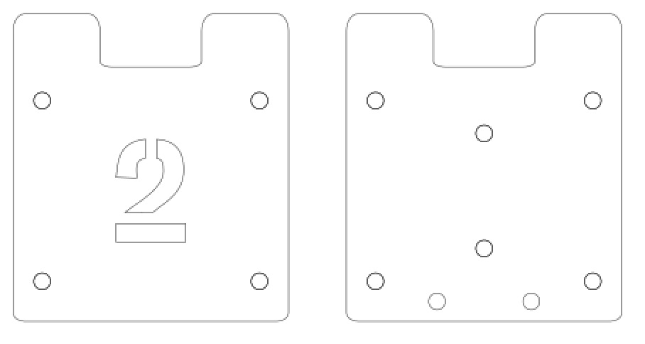
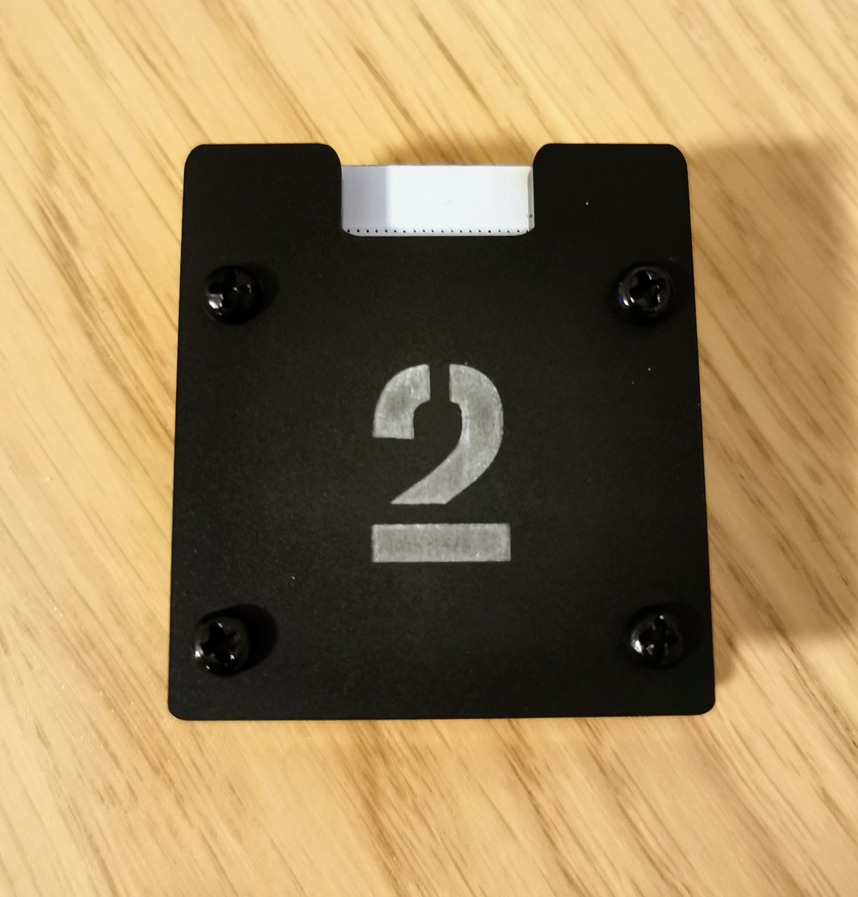
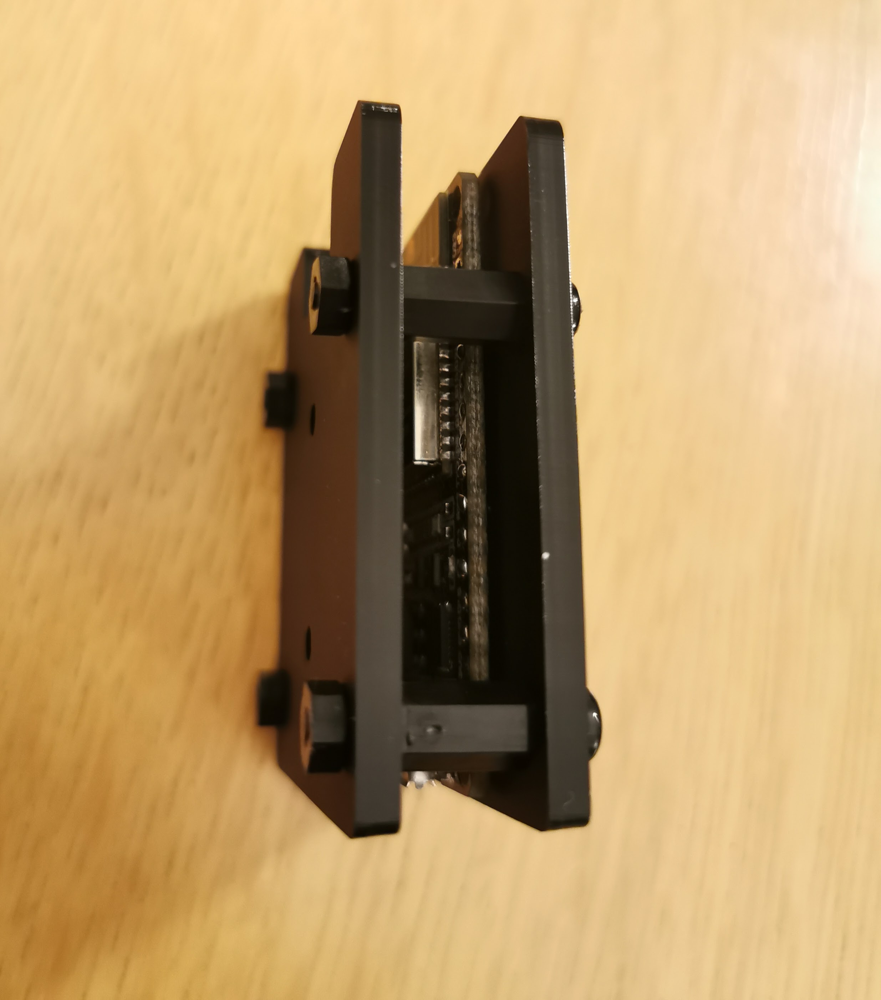
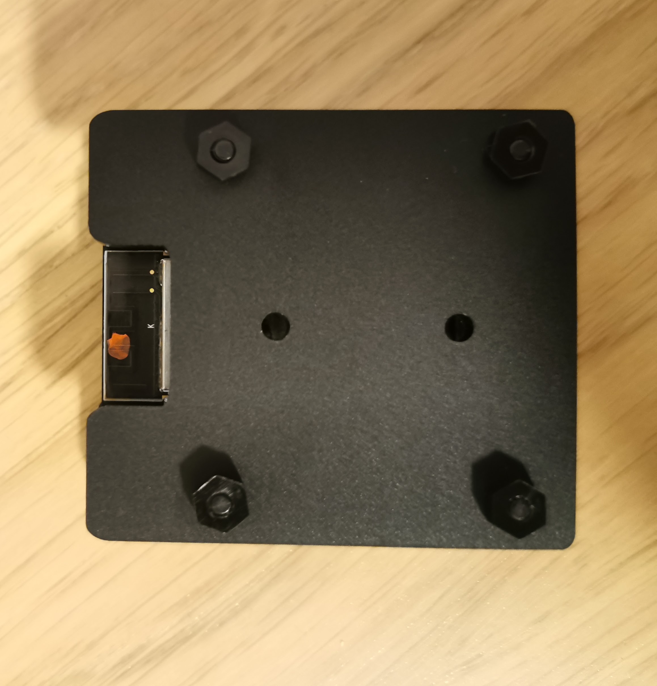

This is my first attempt at making a laser cut "case" for an ESP32 Dev module. There are versions with and without engraved numbers. The "notch" is an attempt to not cover the onboard antenna however I'm well aware it probably makes negligble difference. There are also (optional) holes to expose the Enable and Boot buttons, although these were omitted in the images.

This is currently a work in progress so your mileage may vary.

## Images

SVG for the case:  

Top of case:  

Side of case:  

Bottom of case:  

## Assembly

- Cut the mount out of ~3mm acrylic with a laser cutter.
- Remove header pins from ESP module
- Attach ESP module to case with adhesive tape or hot melt glue
- Mount with M3 standoffs

## Licence

This project is licensed under the [Creative Commons CC BY-NC-SA 4.0](https://creativecommons.org/licenses/by-nc-sa/4.0/) licence.

You are free to share and adapt the code as required, however you *must* give appropriate credit and indicate what changes have been made. You must also distribute your adaptation under the same license. Commercial use is prohibited.

## Acknowledgements

Thanks to the [London Hackspace](https://london.hackspace.org.uk/) for use of the Laser Cutter.

